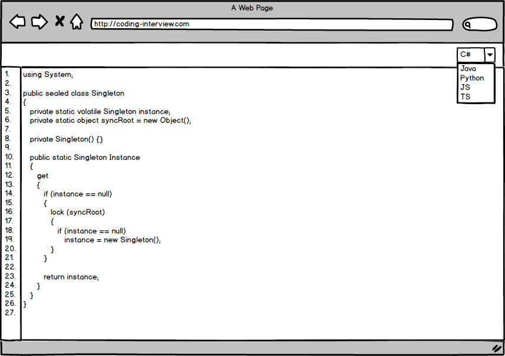

# Coding-Interview

Projet fil-rouge de l’expertise Front-End qui permet de faciliter les entretiens techniques en proposant une application web de partage et d’édition en direct de code. Les principales fonctionnalités sont :
* Edition par le candidat / Visualisation par l’évaluateur
* Coloration syntaxique sur plusieurs langages (C# / Java / Python / JS / TS)
* Sauvegarde d’exercices via des URL réservées

